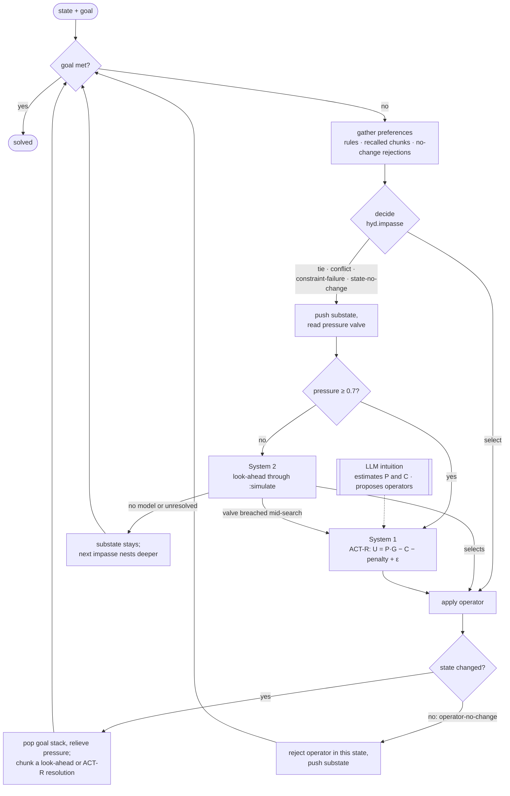

# cognitive-hydraulics

A neurosymbolic reasoning engine on [Jolt](https://github.com/jolt-lang/jolt).
Deliberate symbolic reasoning (System 2) with a heuristic fallback (System 1), bridged by an LLM intuition source.
In Kautz's taxonomy it is *Symbolic[Neural]*: the symbolic engine stays in control and consults the LLM as a
heuristic oracle at defined points, to estimate success and cost when the pressure valve trips, and to propose
operators when the rules have none. The LLM never touches the symbolic structures; it returns judgments the
core weighs, and the core runs unchanged with a deterministic stub in its place.

A pure symbolic core built on a Soar-style decision cycle and impasse taxonomy, with ACT-R's utility equation as the fallback.
On an impasse, the core first deliberates by look-ahead. When a pressure valve signals that deliberation is stalling,
it falls back to System 1: ACT-R utility over success and cost estimates supplied by an LLM.
Resolutions are stored as chunks, so the same impasse never happens twice.

## The idea

One cycle: **preferences → decide → apply, or impasse**.

```mermaid
flowchart TD
    start([state + goal]) --> met{goal met?}
    met -- yes --> done([solved])
    met -- no --> prefs["gather preferences<br/>rules · recalled chunks · no-change rejections"]
    prefs --> decide{"decide<br/>hyd.impasse"}
    decide -- select --> apply[apply operator]
    decide -- "tie · conflict ·<br/>constraint-failure · state-no-change" --> push["push substate,<br/>read pressure valve"]
    push --> valve{"pressure ≥ 0.7?"}
    valve -- no --> s2["System 2<br/>look-ahead through :simulate"]
    valve -- yes --> s1["System 1<br/>ACT-R: U = P·G − C − penalty + ε"]
    llm[["LLM intuition<br/>estimates P and C · proposes operators"]] -.-> s1
    s2 -- selects --> apply
    s2 -- valve breached mid-search --> s1
    s2 -- "no model or unresolved" --> nest["substate stays;<br/>next impasse nests deeper"]
    s1 --> apply
    apply --> changed{state changed?}
    changed -- yes --> pop["pop goal stack, relieve pressure;<br/>chunk a look-ahead or ACT-R resolution"]
    changed -- "no: operator-no-change" --> reject["reject operator in this state,<br/>push substate"]
    pop --> met
    reject --> met
    nest --> met
```

- Rules (pure data) state Soar preferences about operators: acceptable at a
  priority, reject, prohibit, require, best, worst, better/worse.
- `hyd.impasse/decide` reads them in Soar's order and selects one operator
  or names the impasse: `:tie`, `:conflict` (mutual better),
  `:constraint-failure` (competing requires), `:state-no-change` (nothing
  acceptable). The fifth, `:operator-no-change`, is detected on apply: an
  operator that fails or changes nothing is rejected in that state.
- An impasse pushes a substate and reads the **pressure valve** — goal-stack
  depth, time in the current state, impasses since the last progress,
  ambiguity of the proposals. Progress pops the stack and relieves it.
- Below the threshold (0.7) **System 2** deliberates: look-ahead through the
  domain's `:simulate` model turns the candidates into best/worst/reject
  preferences. Each level searched is a deeper substate, so a long search
  breaches the valve on its own. Unresolved, the next impasse nests deeper.
- At or above it **System 1** acts: the ACT-R expected gain
  `U = P·G − C − penalty + ε`, with P and C estimated by the intuition
  source and ε logistic noise from a seeded pure generator. Silent
  intuition means an indifferent pick.
- A resolution that made progress is filed as a **chunk**; `solve` recalls
  chunks (same goal, similar state) as learned best preferences, so the
  same situation never impasses twice.

## Running

    jolt -M:test             # full suite (one process per namespace)
    jolt -M:check            # writ specs: impasse, pressure, actr, memory, agent
    jolt -M:run              # blocks demo: goal-directed rules, clean solve
    jolt -M:run --naive      # no model: substates nest, then System 1 fires
    jolt -M:run --lookahead  # with a model: System 2 settles the tie

A full end-to-end example with a live LLM lives in
[examples/incident](examples/incident): an on-call triage world where the
runbook ties, DeepSeek breaks the tie, and the chunk store makes the second
incident free.

The naive demo's trace shows the valve:

    0 :subgoal - (tie, depth 1, pressure 0.38)
    1 :subgoal - (tie, depth 2, pressure 0.62)
    2 :actr :move {:b :a, :to :b} (tie, depth 3, pressure 0.85)

With nothing to deliberate with, each substate impasses again beneath the
last; pressure crosses the threshold, the intuition's estimate picks the
goal move, and the resolution is chunked. Give the agent a model
(`--lookahead`) and System 2 settles the same tie in one cycle.

## Design notes

- **Everything pure — no IO in the core.** The cycle, the valve, and the equation are pure functions over plain maps; the only IO is `hyd.persist` (chunk store as EDN), kept out of the checked namespaces. Inference is a protocol (`hyd.llm/Intuition`); the engine does no HTTP and ships no JSON or clock deps — adapters live in [examples/incident](examples/incident), which supplies two engines (DeepSeek over chat-completions, Lev over calibrated choice) against the same seam.
- **Operators are keyed by their whole map.** `{:op :move :args {:b :a :to :b}}` — moving a onto b and b onto a are different operators with different utilities.
- **Tabu counts fight loops.** An operator already applied n times is discounted n·penalty, so repetition loses to fresh options.
- **Noise replays.** ACT-R's utility noise is drawn from a Park–Miller generator threaded through the run; `:seed` in params replays a run exactly.
- **Params merge over defaults.** Pass only what you change; see `hyd.core/defaults` for the valve weights, thresholds, `:cycle-ms`, `:max-lookahead`, `:noise-s` and `:chunk-threshold`.
- **Specs first.** Every pure namespace has a [writ](https://github.com/jlt-commons/writ) spec in `test/` stating what it means: the decision procedure's preference semantics, the valve math, the utility equation, chunk recall, and the cycle's behaviour scenario by scenario.
- **The stub is first-class.** Every test and the demo run against a deterministic `StubLLM`; the real adapter is a drop-in.
