# Cognitive Hydraulics 🧠

**A hybrid neuro-symbolic reasoning engine combining Soar (System 2) + ACT-R (System 1) with LLM-driven heuristics**

[](https://www.python.org/downloads/)
[](https://github.com/yourusername/cognitive-hydraulics)
[](https://github.com/yourusername/cognitive-hydraulics)
[](https://opensource.org/licenses/MIT)

---

## 🎯 Overview

We have all experienced the frustration of watching an AI agent get stuck in a "loop of doom," where it fails a task, apologizes, and then tries the exact same failed approach again. This happens because current architectures blindly trust a Large Language Model to handle every single step of a process, essentially asking a creative writing engine to perform strict logic. This project explores a new architecture called "Cognitive Hydraulics" that treats reasoning like a pressure system with two distinct modes.

In this system, the agent defaults to a rigid, symbolic logic layer that operates like a standard computer program: it’s fast, incredibly cheap, and physically incapable of hallucinating because it follows strict rules. The LLM is only engaged as a "relief valve" when that logic layer hits an impasse where the "pressure" of ambiguity gets too high. When the valve opens, the LLM provides a creative intuition to unblock the system, and then the valve closes to verify that solution with logic.

Additionally, the approach solves the amnesia problem common in current agents. When the LLM successfully improvises a solution, the system "chunks" that success, converting the expensive, creative guess into a cheap, hard-coded rule for the future. It mimics how humans move from clumsy beginner thinking to muscle memory. Instead of a chaotic, hallucinating chatbot, you get a system that acts like a sober project manager: handling the routine paperwork with precision and only calling in the "creative genius" when a truly novel problem needs solving.

Cognitive Hydraulics treats reasoning as a **pressure system** with two distinct modes:

**🐢 System 2 (Soar)** - Slow, deliberate, symbolic reasoning
- Rule-based pattern matching
- Sub-goal creation
- Impasse detection
- **Fast, cheap, cannot hallucinate**

**🐇 System 1 (ACT-R)** - Fast, heuristic reasoning
- Utility-based selection: U = P×G - C - HistoryPenalty + Noise
- LLM for probability/cost estimation
- Tabu Search: History penalty prevents operator loops
- Automatic fallback on cognitive overload

**🧬 Evolutionary Solver** - Genetic algorithm fallback
- Population-based code fix generation
- Fitness evaluation (syntax, runtime, correctness)
- Mutation and selection for convergence
- Triggered when ACT-R fails or pressure ≥ 0.9

**🧠 The Innovation: Pressure Valve**
- Defaults to symbolic logic (Soar)
- Monitors cognitive "pressure" (depth, time, ambiguity)
- Falls back to LLM heuristics (ACT-R) when stuck
- **Evolutionary fallback** when ACT-R fails or pressure very high
- **Tabu Search** prevents infinite loops on same operators
- **Learns** successful heuristics as new rules (chunking)

### Why This Matters

Current AI agents get stuck in "loops of doom" because they use LLMs for *everything*. Cognitive Hydraulics solves this by:

1. **Using logic first** - Fast, cheap, deterministic (like a sober project manager)
2. **LLM as relief valve** - Only when truly stuck (creative genius on-call)
3. **Learning from success** - Converts expensive guesses into cheap rules
4. **No amnesia** - Remembers what worked (chunking system)

**Result**: An agent that improves over time, rarely hallucinates, and knows when to think fast vs. slow.

---

## 🚀 Quick Start

### Prerequisites

- **Python 3.10-3.12** (Python 3.12 recommended for full functionality)
  - ⚠️ **Note**: Python 3.14+ works but disables learning/chunking (see [PYTHON_3_14_COMPATIBILITY.md](PYTHON_3_14_COMPATIBILITY.md))
- **Ollama** for local LLM

```bash
# Install Ollama
curl -fsSL https://ollama.com/install.sh | sh

# Pull the model (8B parameter model, good balance of speed/quality)
ollama pull qwen3:8b
```

### Installation

#### 1. Clone the Repository

```bash
git clone https://github.com/yourusername/cognitive-hydraulics.git
cd cognitive-hydraulics
```

#### 2. Create and Activate Virtual Environment

**On macOS/Linux (using Python 3.12):**
```bash
# Use Python 3.12 for full functionality (including learning)
python3.12 -m venv venv
source venv/bin/activate

# Verify Python version
python --version  # Should show Python 3.12.x
```

**On macOS/Linux (using default Python):**
```bash
python3 -m venv venv
source venv/bin/activate
```

**On Windows:**
```bash
python -m venv venv
venv\Scripts\activate
```

> **💡 Tip**: For full functionality including learning/chunking, use Python 3.12. See [SETUP_PYTHON_3_12.md](SETUP_PYTHON_3_12.md) for detailed setup instructions.

#### 3. Install Dependencies

```bash
# Upgrade pip
pip install --upgrade pip

# Install the package in editable mode
pip install -e .

# Verify installation
python -m cognitive_hydraulics --version
```

#### 4. Verify Setup

```bash
# Check that Ollama is running
ollama list

# Show system info
python -m cognitive_hydraulics info
```

> **💡 Note:** To deactivate the virtual environment later, simply run `deactivate`

### Configuration

Cognitive Hydraulics uses a configuration file to manage settings. On first run, a default config file is automatically created at `~/.cognitive-hydraulics/config.json`.

**Default Configuration:**
```json
{
  "llm_model": "qwen3:8b",
  "llm_host": "http://localhost:11434",
  "llm_temperature": 0.3,
  "llm_max_retries": 2,
  "actr_goal_value": 10.0,
  "actr_noise_stddev": 0.5,
  "cognitive_depth_threshold": 3,
  "cognitive_time_threshold_ms": 500.0,
  "cognitive_max_cycles": 100,
  "cognitive_history_penalty_multiplier": 2.0,
  "evolution_enabled": true,
  "evolution_population_size": 3,
  "evolution_max_generations": 3
}
```

**Configuration Settings:**
- `llm_model`: Ollama model name (default: `qwen3:8b`)
- `llm_host`: Ollama server URL (default: `http://localhost:11434`)
- `llm_temperature`: LLM sampling temperature 0.0-2.0 (default: `0.3`)
- `llm_max_retries`: Maximum retry attempts for LLM queries (default: `2`)
- `actr_goal_value`: Goal value G in utility equation (default: `10.0`)
- `actr_noise_stddev`: Standard deviation for utility noise (default: `0.5`)
- `cognitive_depth_threshold`: Max sub-goal depth before fallback (default: `3`)
- `cognitive_time_threshold_ms`: Max time in state before fallback in ms (default: `500.0`)
- `cognitive_max_cycles`: Maximum decision cycles (default: `100`)
- `cognitive_history_penalty_multiplier`: Tabu Search penalty multiplier (default: `2.0`)
- `evolution_enabled`: Enable evolutionary solver fallback (default: `true`)
- `evolution_population_size`: Number of candidates in population (default: `3`, range: 2-10)
- `evolution_max_generations`: Maximum generations for evolution (default: `3`, range: 1-10)

**CLI Override:** Command-line arguments override config values. For example, `--max-cycles 50` will override `cognitive_max_cycles` from the config file.

**Custom Config Path:** Use `--config /path/to/config.json` to specify a custom configuration file.

### Basic Usage

```bash
# Show architecture info
python -m cognitive_hydraulics info

# Run an example
python examples/basic_example.py

# Find and fix a bug (example included)
python examples/bug_fix_example.py

# Solve a goal (dry-run mode)
python -m cognitive_hydraulics solve "Fix the bug in sort.py" --dir ./examples --dry-run

# Enable learning
python -m cognitive_hydraulics solve "Debug function" --learning --chunks ./chunks
```

### Example: Finding a Bug

The project includes a buggy `sort.py` file and an example that demonstrates how Cognitive Hydraulics finds and fixes bugs:

```bash
# Run the bug-finding example
python examples/bug_fix_example.py
```

This example:
1. **Reads** the buggy `sort.py` file (contains an IndexError in bubble sort)
2. **Analyzes** the code structure using Tree-sitter AST parsing
3. **Identifies** the bug (loop goes out of bounds: `range(0, n - i)` should be `range(0, n - i - 1)`)
4. **Suggests** a fix using the hybrid Soar+ACT-R reasoning

The bug: The inner loop in `sort_numbers()` uses `range(0, n - i)` which causes `result[j + 1]` to go out of bounds. The fix is to change it to `range(0, n - i - 1)`.

### Python API

```python
import asyncio
from cognitive_hydraulics.engine import CognitiveAgent
from cognitive_hydraulics.core.state import EditorState, Goal
from cognitive_hydraulics.safety import SafetyConfig

async def main():
    # Create agent
    agent = CognitiveAgent(
        safety_config=SafetyConfig(dry_run=True),
        enable_learning=True,
        max_cycles=100,
    )

    # Define goal and initial state
    state = EditorState(working_directory="./project")
    goal = Goal(description="Understand the code structure")

    # Run agent
    success, final_state = await agent.solve(goal, state, verbose=True)

    if success:
        print("✅ Goal achieved!")

asyncio.run(main())
```

---

## 📚 Architecture

### System Flow Diagram

```mermaid
flowchart TD
    Start([Goal Defined]) --> Propose[🧠 PROPOSE Phase]

    Propose --> CheckMemory{Check Learned<br/>Chunks?}
    CheckMemory -->|Found Match| ExecuteChunk[⚡ Execute from Memory<br/>10x faster!]
    CheckMemory -->|No Match| RunRules[📋 Run Production Rules]

    RunRules --> Decide[⚖️ DECIDE Phase]
    Decide --> DetectImpasse{Impasse?}

    DetectImpasse -->|No Impasse| Apply[✅ APPLY Phase]
    DetectImpasse -->|TIE/NO_CHANGE| Monitor[🧠 Meta-Cognitive Monitor]

    Monitor --> CalcPressure[Calculate Pressure:<br/>• Depth<br/>• Time<br/>• Loops<br/>• Ambiguity]
    CalcPressure --> CheckPressure{Pressure ≥ 0.7?}

    CheckPressure -->|Low Pressure| CreateSubgoal[Create Sub-Goal<br/>Stay in Soar]
    CheckPressure -->|High Pressure| ACTR[🚨 ACT-R Fallback]
    CheckPressure -->|Very High ≥0.9| Evolution[🧬 Evolutionary Solver]

    ACTR --> LLM[🤖 Query LLM for<br/>Utility Estimates]
    LLM --> CalcUtility[Calculate U = P×G - C - Penalty + Noise]
    CalcUtility --> CheckHistory{History<br/>Penalty?}
    CheckHistory -->|Repeated Op| ApplyPenalty[Apply Tabu Penalty<br/>Prevent Loops]
    CheckHistory -->|New Op| SelectBest[Select Highest Utility]
    ApplyPenalty --> SelectBest

    ACTR -->|Failed| Evolution
    Evolution --> GeneratePop[Generate Population<br/>of Fix Candidates]
    GeneratePop --> Evaluate[Evaluate Fitness<br/>Syntax/Runtime/Correctness]
    Evaluate --> SelectBest[Select Best Candidate]
    SelectBest -->|Not Perfect| Mutate[Mutate & Evolve]
    Mutate --> Evaluate

    SelectBest --> SafetyCheck{Safety Check}
    SafetyCheck -->|Destructive/Low U| Approval[🚨 Request Human Approval]
    SafetyCheck -->|Safe| Execute[▶ Execute Operator]
    Approval -->|Approved| Execute
    Approval -->|Rejected| Fail[❌ Operation Rejected]

    Execute --> Success{Success?}
    Success -->|Yes| Learn[💾 Create Chunk<br/>Learn from Success]
    Success -->|No| Record[📝 Record Failure]

    Learn --> UpdateMemory[Update ChromaDB]
    UpdateMemory --> NextCycle{More Work?}
    Record --> NextCycle

    Apply --> UpdateState[Update Working Memory]
    UpdateState --> NextCycle
    ExecuteChunk --> NextCycle
    CreateSubgoal --> Propose

    NextCycle -->|Yes| Propose
    NextCycle -->|No| End([🎯 Goal Complete])
    Fail --> End

    style Start fill:#90EE90
    style End fill:#FFB6C1
    style ACTR fill:#FFD700
    style Monitor fill:#87CEEB
    style Learn fill:#DDA0DD
    style Approval fill:#FF6B6B
```



### State Machine

```mermaid
stateDiagram-v2
    [*] --> Proposing: Start Decision Cycle

    Proposing --> CheckingMemory: Check Chunks
    CheckingMemory --> ExecutingChunk: Chunk Found (Success Rate > 70%)
    CheckingMemory --> ApplyingRules: No Matching Chunk

    ApplyingRules --> Deciding: Rules Applied

    Deciding --> DetectingImpasse: Evaluate Operators

    DetectingImpasse --> Applying: Single Operator (No Impasse)
    DetectingImpasse --> MonitoringPressure: Impasse Detected (TIE/NO_CHANGE)

    MonitoringPressure --> CalculatingPressure: Check Cognitive Load

    CalculatingPressure --> CreatingSubgoal: Pressure < 0.7 (CALM/ELEVATED)
    CalculatingPressure --> ACTRFallback: Pressure ≥ 0.7 (HIGH/CRITICAL)
    CalculatingPressure --> EvolutionaryFallback: Pressure ≥ 0.9 OR ACT-R Failed

    CreatingSubgoal --> Proposing: Sub-goal Created

    ACTRFallback --> QueryingLLM: System 1 Engaged
    QueryingLLM --> EstimatingUtility: Get P (Probability) & C (Cost)
    EstimatingUtility --> ApplyingHistoryPenalty: Apply Tabu Search Penalty
    ApplyingHistoryPenalty --> SelectingOperator: Calculate U = P×G - C - Penalty

    EvolutionaryFallback --> GeneratingPopulation: Generate Diverse Fix Candidates
    GeneratingPopulation --> EvaluatingFitness: Score Each Candidate (0-100)
    EvaluatingFitness --> SelectingBest: Select Highest Score
    SelectingBest -->|Score < 100| MutatingCandidate: Mutate Based on Feedback
    MutatingCandidate --> EvaluatingFitness: Re-evaluate
    SelectingBest -->|Score = 100| ApplyingFix: Apply Perfect Fix

    SelectingOperator --> CheckingSafety: Operator Selected

    CheckingSafety --> RequestingApproval: Destructive OR Low Utility
    CheckingSafety --> Executing: Safe Operation

    RequestingApproval --> Executing: Approved
    RequestingApproval --> [*]: Rejected

    Executing --> CheckingSuccess: Operator Executed

    CheckingSuccess --> Learning: Success
    CheckingSuccess --> RecordingFailure: Failure

    Learning --> StoringChunk: Create Chunk
    StoringChunk --> UpdatingMemory: Store in ChromaDB

    RecordingFailure --> UpdatingMemory: Record Transition

    UpdatingMemory --> CheckingGoal: Update Working Memory
    Applying --> UpdatingMemory: Apply Success
    ExecutingChunk --> UpdatingMemory: Chunk Executed

    CheckingGoal --> [*]: Goal Complete
    CheckingGoal --> Proposing: Continue

    note right of CheckingMemory
        💡 Memory Retrieval
        Semantic similarity search
        Activation-based selection
    end note

    note right of MonitoringPressure
        🧠 Cognitive Pressure
        • Sub-goal depth (0-1)
        • Time in state (0-1)
        • Loop detection (0-1)
        • Ambiguity (0-1)
    end note

    note right of ACTRFallback
        🚨 System 2 → System 1
        Slow → Fast
        Logic → Heuristic
    end note

    note right of Learning
        💾 Chunking
        Converts expensive LLM
        guess into cheap rule
    end note
```



### Component Interaction


### The Cognitive Cycle

```
┌─────────────────────────────────────────────────────┐
│                  SOAR (System 2)                     │
│   ┌─────────────────────────────────────┐           │
│   │ 1. PROPOSE                          │           │
│   │    • Check learned chunks (memory)   │           │
│   │    • Apply production rules          │           │
│   │    • Generate operators              │           │
│   └─────────────────────────────────────┘           │
│                     ↓                                │
│   ┌─────────────────────────────────────┐           │
│   │ 2. DECIDE                            │           │
│   │    • Compare operators               │           │
│   │    • Detect impasses (TIE, NO_CHANGE)│           │
│   └─────────────────────────────────────┘           │
│                     ↓                                │
│   ┌─────────────────────────────────────┐           │
│   │ 3. APPLY                             │           │
│   │    • Execute with safety checks      │           │
│   │    • Update working memory           │           │
│   └─────────────────────────────────────┘           │
└─────────────────────────────────────────────────────┘
                     ↓ (if impasse)
┌─────────────────────────────────────────────────────┐
│            META-COGNITIVE MONITOR                    │
│   ┌─────────────────────────────────────┐           │
│   │ Calculate Pressure:                  │           │
│   │  • Sub-goal depth                    │           │
│   │  • Time in state                     │           │
│   │  • Repeated failures (loops)         │           │
│   │  • Ambiguity (operator ties)         │           │
│   │                                      │           │
│   │ Pressure ≥ 0.7? → Trigger Fallback   │           │
│   └─────────────────────────────────────┘           │
└─────────────────────────────────────────────────────┘
                     ↓ (if pressure high)
┌─────────────────────────────────────────────────────┐
│                ACT-R (System 1)                      │
│   ┌─────────────────────────────────────┐           │
│   │ 4. LLM UTILITY ESTIMATION            │           │
│   │    • Compress state for LLM          │           │
│   │    • Query: "What's P and C?"        │           │
│   │    • Apply Tabu penalty (history)    │           │
│   │    • Calculate: U = P×G - C - Penalty│           │
│   │    • Select highest utility          │           │
│   └─────────────────────────────────────┘           │
│                     ↓ (if ACT-R fails or pressure ≥ 0.9)
│   ┌─────────────────────────────────────┐           │
│   │ 4b. EVOLUTIONARY SOLVER              │           │
│   │    • Generate population (3-10)     │           │
│   │    • Evaluate fitness (0-100)       │           │
│   │    • Mutate best candidate          │           │
│   │    • Evolve until perfect (≤3 gen)  │           │
│   └─────────────────────────────────────┘           │
│                     ↓                                │
│   ┌─────────────────────────────────────┐           │
│   │ 5. LEARN (Chunking)                  │           │
│   │    • If success → Create chunk       │           │
│   │    • Store in Unified Memory         │           │
│   │    • Next time: Skip LLM, use chunk  │           │
│   └─────────────────────────────────────┘           │
└─────────────────────────────────────────────────────┘
```

### Key Components

#### 1. **Soar Decision Engine** (System 2)
- **Rule Engine**: Pattern matching with 5 default rules
- **Impasse Detector**: NO_CHANGE, TIE, CONFLICT detection
- **Working Memory**: State transitions, loop detection, rollback
- **Sub-goaling**: Hierarchical goal decomposition

#### 2. **ACT-R Resolver** (System 1)
- **Utility Formula**: U = P×G - C - HistoryPenalty + Noise
  - P: Probability of success (LLM estimate)
  - G: Goal value (configurable, default 10.0)
  - C: Cost (LLM estimate, 1-10 scale)
  - HistoryPenalty: Tabu Search penalty (action_count × multiplier, default 2.0)
  - Noise: Exploration (Gaussian, σ=0.5)
- **Tabu Search**: Prevents infinite loops by penalizing repeated operators
- **LLM Integration**: Ollama with JSON schema enforcement
- **Structured Prompts**: Context-aware, explains formula

#### 3. **Meta-Cognitive Monitor**
- **Pressure Calculation**: Weighted sum of 4 factors
  - Sub-goal depth (0.0-1.0)
  - Time in state (0.0-1.0)
  - Loop detection (0.0-1.0)
  - Operator ambiguity (0.0-1.0)
- **Fallback Trigger**: pressure ≥ 0.7
- **Status Display**: 🟢 CALM → 🟡 ELEVATED → 🟠 HIGH → 🔴 CRITICAL

#### 4. **Evolutionary Solver** (Genetic Algorithm Fallback)
- **Population Generation**: LLM generates 3-10 distinct fix candidates
- **Fitness Function**: CodeEvaluator scores each candidate (0-100)
  - Syntax validation (AST parsing)
  - Runtime validation (execution without exceptions)
  - Correctness validation (test execution and passing)
- **Selection & Mutation**: Best candidate is mutated based on fitness feedback
- **Convergence**: Evolves through generations until perfect solution (score=100)
- **Trigger Conditions**:
  - ACT-R fails to generate/evaluate operators
  - Cognitive pressure ≥ 0.9 (very high)
  - Only for code-fixing goals

#### 5. **Learning System** (Chunking)
- **Unified Memory**: Combines operational memory (goal stack) and chunking
- **Chunk Model**: (State Signature, Operator, Success Rate)
- **Activation**: A = ln(frequency) - decay×time
- **ChromaDB**: Semantic similarity search for both chunks and past solutions
- **Success Filtering**: Only use chunks with >70% success rate
- **10x Speedup**: Skip LLM when chunk matches

#### 6. **Safety Layer**
- **Human Approval**: Required for destructive operations
- **Utility-Based Safety**: Approval if U < 3.0
- **Dry-Run Mode**: Simulate without executing
- **Auto-Approval**: Safe operations (read, list, search)

#### 7. **Tree-Sitter Integration**
- **Multi-Language AST**: Python, JS, TS, Rust, Go, Java, C, C++
- **Intelligent Extraction**: Functions, classes, imports
- **Context Compression**: Relevant code for LLM prompts

---

## 🎨 Features

### ✅ **Safety First**
- Human approval for destructive operations
- Dry-run mode for testing
- Rollback support
- Approval statistics tracking

### ✅ **Multi-Language Support**
- Tree-sitter AST parsing
- 8+ languages supported
- Structural code understanding

### ✅ **Structured LLM Output**
- JSON schema enforcement (Pydantic)
- No free-form hallucination
- Automatic retries on validation failure

### ✅ **Learning from Experience**
- Chunking system (ACT-R → Soar rules)
- Unified Memory: Operational memory + chunking
- ChromaDB semantic memory
- Persistent storage option
- 10x speedup on repeated patterns

### ✅ **Evolutionary Problem Solving**
- Genetic algorithm for code fixes
- Population-based candidate generation
- Fitness evaluation (syntax, runtime, correctness)
- Mutation and convergence
- Tabu Search prevents operator loops

### ✅ **Explainable Reasoning**
- Full decision cycle traces
- Cognitive pressure metrics
- Rule/operator selection logs
- Clear System 1 ↔ System 2 switching

### ✅ **Beautiful CLI**
- Rich terminal output (colors, panels)
- Progress indicators
- Syntax highlighting
- Comprehensive options

---

## 📖 Example Scenario

**Problem**: Fix an IndexError in a file with multiple loops

```
Goal: Fix the IndexError in process_data()

Cycle 1: SOAR (System 2 - Symbolic Reasoning)
├─ 📋 PROPOSE: Rule matches "IF IndexError THEN check_loop_bounds"
├─ ⚖️  DECIDE: Multiple loops found (LoopA, LoopB)
├─ ⚠️  IMPASSE: TIE (2 candidates, equal priority)
└─ 🧠 META-MONITOR: Pressure = 0.42 (CALM)
    ├─ Depth: 0/3
    ├─ Time: 0ms
    ├─ Loops: 0
    └─ Ambiguity: 1.0 (2 options)

Sub-Goal Created: "Determine which loop causes error"

Cycle 2: SOAR (System 2)
├─ 📋 PROPOSE: Try static analysis rules
├─ ⚠️  IMPASSE: NO_CHANGE (cannot determine statically)
└─ 🧠 META-MONITOR: Pressure = 0.78 (🔴 CRITICAL)
    ├─ Depth: 1/3
    ├─ Time: 450ms
    ├─ Loops: 0
    └─ Ambiguity: 1.0

🚨 PRESSURE THRESHOLD BREACHED → ACT-R FALLBACK

Cycle 3: ACT-R (System 1 - Heuristic Reasoning)
├─ 🤖 Querying LLM for utility estimates...
│   LoopA (line 15): U=2.3 (P=0.40, C=6.0, noise=-0.7)
│   LoopB (line 42): U=7.2 (P=0.85, C=3.0, noise=+0.2)
│      └─ "Loop B uses i+1 indexing, high overflow risk"
│
├─ ✓ Selected: check_loop_bounds(line=42) (U=7.2)
├─ 🚨 Requires approval (destructive operation)
│   [a] Approve  [r] Reject  [q] Quit
│   User: a
│
├─ ▶ Executing: check_loop_bounds(line=42)
├─ ✓ Success: Fixed index bounds
└─ 💾 LEARNING: Created chunk
    └─ Chunk(id=a7f3b2..., success_rate=100%, activation=1.8)

Next Time (Similar Error):
├─ 💡 Memory: Found matching chunk
│   └─ "IndexError + i+1 pattern → check line 42"
├─ ⚡ Execute instantly (0.5s vs 5s)
└─ ✓ Success (no LLM call needed)
```

---

## 🛠️ CLI Reference

### Commands

```bash
# Show version
cognitive-hydraulics version

# Show architecture info
cognitive-hydraulics info

# Solve a goal
cognitive-hydraulics solve "Your goal" [OPTIONS]

# Manage chunks
cognitive-hydraulics chunks [OPTIONS]

# Run examples
cognitive-hydraulics example [basic|learn]
```

### Options

```
solve OPTIONS:
  --dir, -d PATH              Working directory (default: .)
  --dry-run                   Simulate without executing
  --learning / --no-learning  Enable/disable chunking (default: on)
  --chunks PATH               Persistent chunk storage path
  --max-cycles N              Maximum decision cycles (overrides config)
  --config PATH               Custom config file path (default: ~/.cognitive-hydraulics/config.json)
  --verbose, -v / --quiet, -q Control output verbosity
```

---

## 📊 Project Status

**🎉 ALL PHASES COMPLETE**

- ✅ **Phase 0**: Project Bootstrap
- ✅ **Phase 1**: Core Data Models (State, WorkingMemory, Operators)
- ✅ **Phase 2**: Tree-sitter Integration (AST parsing, multi-language)
- ✅ **Phase 3**: Soar Decision Engine (RuleEngine, Impasse detection)
- ✅ **Phase 4**: LLM Integration (JSON schemas, structured output)
- ✅ **Phase 5**: Operators with Safety (Human approval, sandboxing)
- ✅ **Phase 6**: Memory & Learning (ChromaDB, chunking system)
- ✅ **Phase 7**: CLI & Integration (Typer interface, end-to-end)
- ✅ **Phase 8**: Documentation & Polish

**Statistics:**
- 🧪 287 tests passing
- 📊 67% code coverage
- 📦 2,900+ lines of production code
- 🎯 Zero linting errors
- 🚀 Production ready

---

## 🧑‍💻 Development

### Setup

```bash
# Clone and install
git clone https://github.com/yourusername/cognitive-hydraulics.git
cd cognitive-hydraulics
python -m venv venv
source venv/bin/activate  # Windows: venv\Scripts\activate
pip install -e ".[dev]"
```

### Testing

```bash
# Run all tests
pytest

# With coverage
pytest --cov

# Specific test file
pytest tests/unit/test_chunk.py -v

# Run examples
python examples/basic_example.py
python examples/learning_example.py
```

### Code Quality

```bash
# Format
black src/ tests/

# Lint
ruff check src/ tests/

# Type check
mypy src/
```

---

## 📚 Documentation

- **[architecture.md](./architecture.md)** - Theoretical foundation and cognitive science background
- **[implementation.md](./implementation.md)** - Technical implementation details and phase plan
- **[examples/README.md](./examples/README.md)** - Example scenarios and usage patterns
- **[PHASE_X_COMPLETE.md](.)** - Detailed completion reports for each phase

---

## 🤝 Contributing

Contributions welcome! Areas of interest:

1. **New Operators**: Extend file operations, code analysis, testing
2. **Better Rules**: Improve default Soar production rules
3. **Prompt Engineering**: Optimize LLM prompts for better P/C estimates
4. **Language Support**: Add more Tree-sitter grammars
5. **Benchmarks**: Compare against pure LLM or pure symbolic approaches

### Guidelines

- All PRs must pass tests (`pytest`)
- Code must be formatted (`black`) and linted (`ruff`)
- Add tests for new features
- Update documentation

---

## 📄 License

MIT License - see [LICENSE](LICENSE) for details

---

## 🙏 Acknowledgments

**Theoretical Foundations:**
- [Soar Cognitive Architecture](https://soar.eecs.umich.edu/) - Symbolic reasoning and chunking
- [ACT-R Theory](http://act-r.psy.cmu.edu/) - Utility-based selection and activation
- Daniel Kahneman's "Thinking, Fast and Slow" - Dual-process theory

**Technical Stack:**
- [Ollama](https://ollama.com/) - Local LLM inference
- [ChromaDB](https://www.trychroma.com/) - Vector database for semantic memory
- [Tree-sitter](https://tree-sitter.github.io/) - Multi-language AST parsing
- [Pydantic](https://pydantic.dev/) - Data validation and JSON schemas
- [Typer](https://typer.tiangolo.com/) - CLI framework
- [Rich](https://rich.readthedocs.io/) - Terminal formatting

---

## 📖 Citation

```bibtex
@software{cognitive_hydraulics,
  title = {Cognitive Hydraulics: A Hybrid Neuro-Symbolic Reasoning Engine},
  author = {Cognitive Hydraulics Contributors},
  year = {2025},
  url = {https://github.com/yourusername/cognitive-hydraulics},
  note = {Combining Soar (System 2) + ACT-R (System 1) with LLM-driven heuristics}
}
```

---

## ⭐ Star History

If you find this project useful, please consider giving it a star! It helps others discover the project.

---

**Built with 🧠 by the Cognitive Hydraulics team**
