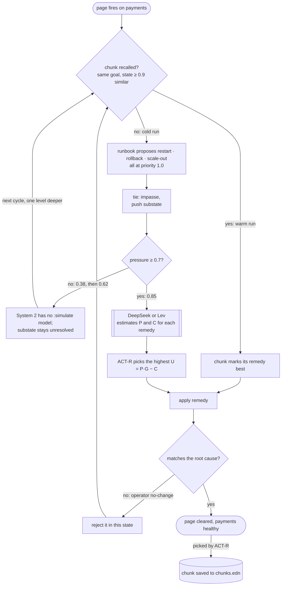

# incident — cognitive-hydraulics as an on-call decision maker

A page fires on `payments`. The runbook knows the remedies (restart,
rollback, scale out) but not which one fits, because that depends on the
root cause. The example runs one shift end to end against a live LLM and
shows four things:

1. **Rules that know the options but can't choose.** The runbook proposes
   every remedy at the same priority, so every decision is a tie. The agent
   has no model of what each remedy would do (`:simulate` is absent), so
   System 2 has nothing to deliberate with.
2. **The pressure valve decides when to ask the LLM, not the impasse.** The
   first two ties just nest substates while pressure climbs (0.38, then
   0.62). Only on the third, at 0.85, does System 1 fire and the LLM get
   called.
3. **The LLM estimates; ACT-R chooses.** DeepSeek (or Lev) returns
   P(success) and cost for each remedy. The utility equation
   `U = P·G − C` picks the winner. Noise is off (`:noise-s 0.0`), so the
   pick is deterministic given the estimates.
4. **Learning takes the LLM out of the loop.** A wrong remedy changes
   nothing, so it's an operator no-change: it's rejected in that state and
   System 1 picks again among the rest. The remedy that clears the page is
   filed as a chunk and saved to `chunks.edn`. Run the same scenario again
   and the chunk fires before any impasse: one cycle, `llm calls: 0`.

## The scenarios

| scenario (`jolt -M:run <name>`) | hidden root cause | remedy that clears it |
| --- | --- | --- |
| `bad-config` (default) | bad config in the last deploy | rollback |
| `memory-leak` | a memory leak | restart |
| `capacity` | not enough capacity | scale out |

Every scenario shows the agent the same signals: service health, the last
deploy (14 minutes old, touching `config/limits.toml` and `src/api.clj`),
and the page (`latency p99 4.2s, error rate 9%`). The root cause is carried
in the state as `:root-cause` and only `world/apply-op` acts on it: a remedy
that doesn't match the cause leaves the state unchanged.

## The flow



On a cold store with `bad-config`, if the LLM rates rollback highest the
trace is `subgoal, subgoal, actr -> rollback`: three cycles, one LLM call.
If it guesses restart first, restart is rejected, the next tie goes straight
back to System 1 (pressure is already past the threshold), and rollback
wins: two LLM calls. The offline tests in `test/ex/incident/main_test.clj`
pin both paths with a stubbed LLM.

## What it doesn't show

- **System 2 doing real work.** The agent has no model of the remedies, so
  look-ahead never runs here. The blocks demo in the repo root
  (`jolt -M:run --lookahead`) shows System 2 settling a tie.
- **Chunks generalising across causes.** States are matched by leaf-fact
  overlap. The scenarios differ only in `:root-cause`, which drops their
  similarity below the 0.9 threshold, so a `bad-config` chunk never fires
  on `memory-leak`. That separation comes from the hidden fact being in the
  state; in a real deployment the observable signals would have to differ.
- **A blind LLM, with DeepSeek.** The DeepSeek adapter sends the full state,
  `:root-cause` included. The Lev adapter projects it out
  (`lev/project-state`), so only Lev has to infer the cause from the
  signals.

## Run it

```fish
set -x DEEPSEEK_API_KEY ...     # already in your environment

jolt -M:run --reset    # cold: tie -> pressure -> DeepSeek -> chunk
jolt -M:run            # warm: chunk hit, zero LLM calls
jolt -M:run memory-leak   # other scenarios: memory-leak, capacity
jolt -M:run --lev --reset  # same, with lev (see below) as the intuition
jolt -M:test           # offline suite (stubbed LLM), no network
```

### lev

[jlt-commons/lev](https://github.com/jlt-commons/lev) is a second
intuition source: `--lev` swaps DeepSeek's chat call for lev's typed
`choice` question over the operators, answered with calibrated
probabilities by a local encoder (~125 ms, no API key). The operator ids
are shared with the DeepSeek adapter, so both key identically, and the
state the model sees is projected — health, deploys, the page — never the
hidden `:root-cause`. Start the server first:

```fish
cd ~/src/jlt-commons/lev && jolt -M:serve &
cd ~/src/cognitive-hydraulics/examples/incident
jolt -M:run --lev --reset
```

`LEV_URL` and `LEV_MODEL` override the endpoint (default
`http://127.0.0.1:8080`, model `english`).

## Layout

- `src/ex/incident/world.clj` — the domain: services, deploys, pages,
  operators with root-cause-dependent outcomes, the tying runbook proposer.
- `src/ex/incident/openai.clj` — the chat-completions engine: an
  OpenAI-compatible adapter (DeepSeek, llama-server, vLLM) implementing
  `hyd.llm/Intuition`, plus the shared `op-id` both engines key by.
- `src/ex/incident/deepseek.clj` — DeepSeek config, and the chunk store's
  file (recall itself is the library's: `solve` takes and returns the
  store).
- `src/ex/incident/lev.clj` — the Lev engine: a typed `choice` question
  over the same operator ids, answered with calibrated probabilities.
- `src/ex/incident/main.clj` — the shift: wires world + agent + the chosen
  engine (`--deepseek` default, `--lev`), prints the trace, persists
  `chunks.edn`.

The library itself is IO-free: HTTP and JSON are declared here, in the
example's `deps.edn`, not in the engine — the two engines are just two
implementations of the same `hyd.llm/Intuition` protocol the decision
cycle calls when pressure opens the valve.

The example has its own `deps.edn` referencing the library by
`{:local/root "../.."}`, so it exercises the engine exactly as a consumer
would.
